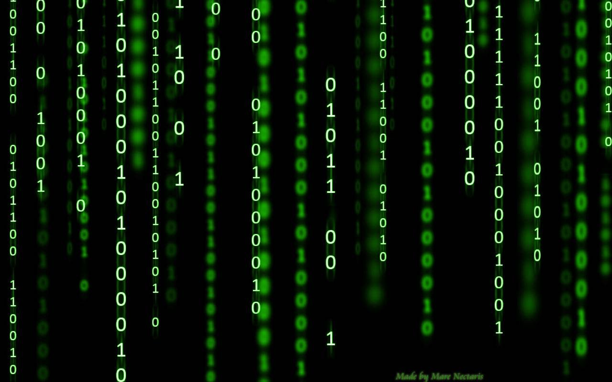

# S21_Matrix+

## Реализация библиотеки `s21_matrix_oop.h`

## Содержание

1. [Глава I](#глава-i)  
   1.1. [Введение](#введение)
2. [Глава II](#глава-ii)  
   2.1. [Информация](#информация)

## Глава I



### Введение

Библиотека `s21_matrix+` предназначена для работы с матрицами и реализована с использованием объектно-ориентированного подхода на языке C++. В библиотеке реализованы основные операции над матрицами, такие как сложение, вычитание, умножение, транспонирование и другие. Все операции выполнены в виде методов класса и перегруженных операторов.

## Глава II

### Информация

#### Пример класса матрицы на C++

```cpp
class S21Matrix {
private:
    // Атрибуты
    int rows_, cols_;         // Количество строк и столбцов
    double **matrix_;         // Указатель на область памяти, где хранится матрица

public:
    S21Matrix();              // Конструктор по умолчанию
    ~S21Matrix();             // Деструктор

    void SumMatrix(const S21Matrix& other);
    // Другие методы...
};
```

````

#### Основные понятия о матрице

Матрица — это прямоугольная таблица чисел, расположенных в \( m \) строках и \( n \) столбцах.

```
    1 2 3
A = 4 5 6
    7 8 9
```

```
     1  2  3  4
B =  5  6  7  8
     9 10 11 12
```

Индексация элементов матрицы осуществляется с помощью строк и столбцов. Например, `A[1,1] = 1`, где первый индекс — номер строки, а второй — номер столбца.

#### Операции над матрицами

Ниже представлено краткое описание операций, реализованных в библиотеке. Некоторые операции могут иметь исключительные ситуации, обрабатываемые с помощью механизма исключений.

| Операция                                 | Описание                                                 | Исключительные ситуации                                   |
| ---------------------------------------- | -------------------------------------------------------- | --------------------------------------------------------- |
| `bool EqMatrix(const S21Matrix& other)`  | Проверяет матрицы на равенство                           |                                                           |
| `void SumMatrix(const S21Matrix& other)` | Прибавляет вторую матрицу к текущей                      | Различная размерность матриц                              |
| `void SubMatrix(const S21Matrix& other)` | Вычитает из текущей матрицы другую                       | Различная размерность матриц                              |
| `void MulNumber(const double num)`       | Умножает текущую матрицу на число                        |                                                           |
| `void MulMatrix(const S21Matrix& other)` | Умножает текущую матрицу на другую                       | Число столбцов первой матрицы не равно числу строк второй |
| `S21Matrix Transpose()`                  | Создает и возвращает новую транспонированную матрицу     |                                                           |
| `S21Matrix CalcComplements()`            | Вычисляет и возвращает матрицу алгебраических дополнений | Матрица не является квадратной                            |
| `double Determinant()`                   | Вычисляет и возвращает определитель текущей матрицы      | Матрица не является квадратной                            |
| `S21Matrix InverseMatrix()`              | Вычисляет и возвращает обратную матрицу                  | Определитель матрицы равен 0                              |

Помимо реализации данных операций, библиотека включает конструкторы и деструкторы:

| Метод                               | Описание                                                                      |
| ----------------------------------- | ----------------------------------------------------------------------------- |
| `S21Matrix()`                       | Базовый конструктор, инициализирующий матрицу с заранее заданной размерностью |
| `S21Matrix(int rows, int cols)`     | Параметризированный конструктор с количеством строк и столбцов                |
| `S21Matrix(const S21Matrix& other)` | Конструктор копирования                                                       |
| `S21Matrix(S21Matrix&& other)`      | Конструктор переноса                                                          |
| `~S21Matrix()`                      | Деструктор                                                                    |

Также перегружены следующие операторы:

| Оператор         | Описание                                          | Исключительные ситуации                                   |
| ---------------- | ------------------------------------------------- | --------------------------------------------------------- |
| `+`              | Сложение двух матриц                              | Различная размерность матриц                              |
| `-`              | Вычитание одной матрицы из другой                 | Различная размерность матриц                              |
| `*`              | Умножение матриц и умножение матрицы на число     | Число столбцов первой матрицы не равно числу строк второй |
| `==`             | Проверка на равенство матриц (`EqMatrix`)         |                                                           |
| `=`              | Присвоение значений одной матрицы другой          |                                                           |
| `+=`             | Присвоение сложения (`SumMatrix`)                 | Различная размерность матриц                              |
| `-=`             | Присвоение разности (`SubMatrix`)                 | Различная размерность матриц                              |
| `*=`             | Присвоение умножения (`MulMatrix`/`MulNumber`)    | Число столбцов первой матрицы не равно числу строк второй |
| `(int i, int j)` | Индексация по элементам матрицы (строка, колонка) | Индекс за пределами матрицы                               |

## Глава III

### Часть 1: Реализация функции библиотеки `s21_matrix_oop.h`

- Программа разработана на языке C++ стандарта C++17 с использованием компилятора GCC.
- Код программы находится в папке `src`.
- Код написан в соответствии с Google Style Guide.
- Матрица реализована в виде класса `S21Matrix`.
- Приватные поля: `matrix_`, `rows_`, и `cols_`.
- Реализован доступ к приватным полям `rows_` и `cols_` через accessor и mutator. При увеличении размера матрица дополняется нулевыми элементами, при уменьшении - лишние элементы отбрасываются.
- Решение оформлено как статическая библиотека с заголовочным файлом `s21_matrix_oop.h`.
- Реализованы операции, описанные [выше](#операции-над-матрицами).
- Перегружены операторы в соответствии с таблицей [выше](#операции-над-матрицами).
- Полное покрытие unit-тестами функций библиотеки с использованием библиотеки GTest.
- Предусмотрен Makefile для сборки библиотеки и тестов с целями `all`, `clean`, `test`, `s21_matrix_oop.a`.


````
